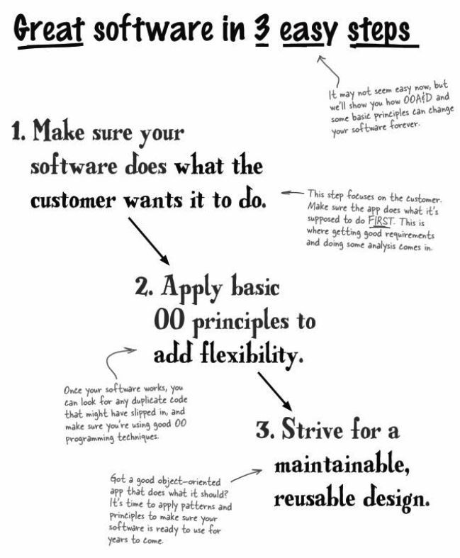

The point of this app is to search for item attributes that match a customer
preference of a guitar. The app matches the guitar in the inventory and returns
a matching guitar if its in the inventory list. If the guitar is not in the list.
then the customer is notified the guitar is not present. 

This is a UML of an inventory management application and a search tool to
help the customer match the instrument they are looking for in the app.

This UML demonstrates the implementation of enumerations used in the search tool 
by getting rid of all the String comparisons. Enumerated types let you define a 
type name like Wood, and then a set of values that are allowed for that type 
(like COCOBOLO, SITKA, and MAHOGANY). 
