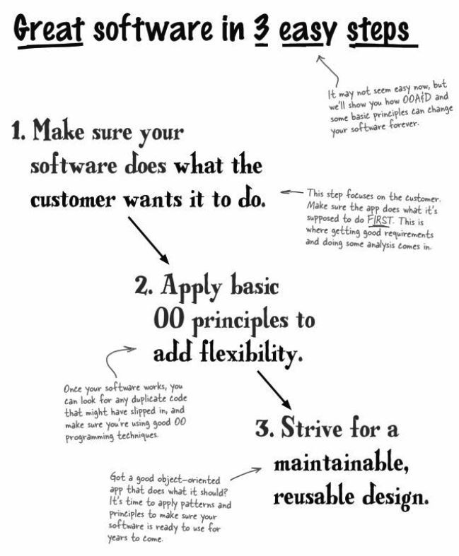
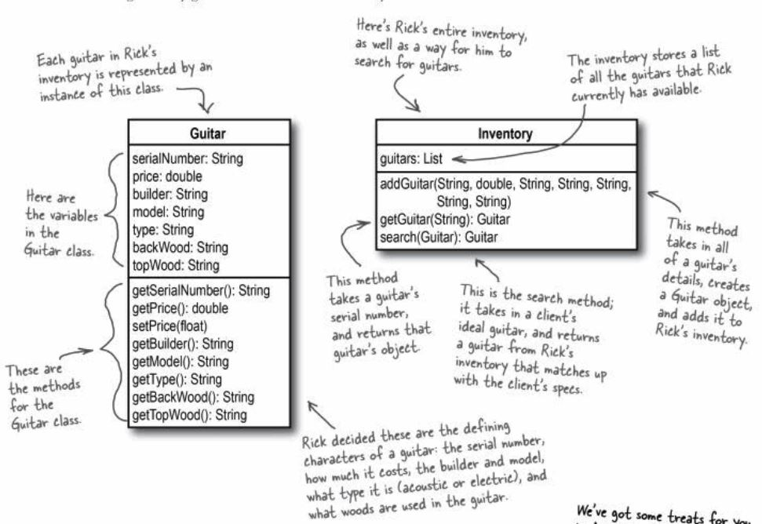
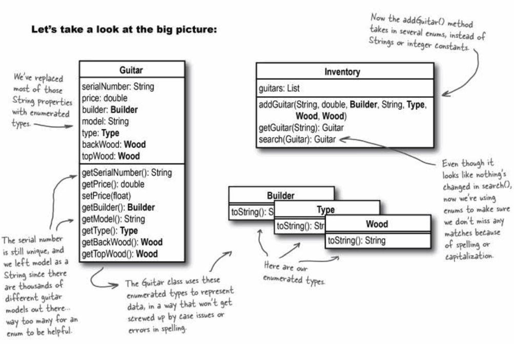

#Chapter 1 - Encapsulation

The point of this app is to search for item attributes that match a customer
preference of a guitar. The app matches the guitar in the inventory and returns
a matching guitar if its in the inventory list. If the guitar is not in the list.
then the customer is notified the guitar is not present.

OOA&D is really just an approach to writing software that focuses on making 
sure your code does what it's supposed to, and that it's well designed. That
means your code is flexible, it's easy to make changes to it, and it's 
maintainable and reusable.

##Unified Modeling Language (UML)
You just need a set of steps to follow that makes sure your software works and
is well designed. It can be as simple as the three steps shown here. You just
need something that works, and that you can use on all of your software projects.

You want to make sure that the application works like it should before you dive
into applying design patterns or trying to do any real restructuring of how the
application is put together.

You're going to make lots of changes to your software when you're getting it to
work right. Trying to do too much design before you've at least got the basic
functionality down can end up being a waste, because a lot of the design will
change as you're adding new pieces of functionality to your classes and methods.

There is nothing that syas you have to follow these steps exactly, but they do 
provide an easy path to follow to make sure your software does what it's 
supposed to, and is well-designed and easy to reuse. If you've got something 
similar that accomplishes the same goals, that's great!

This is a UML of an inventory management application, and a search tool to
help the customer match the instrument they are looking for in the app.

This UML demonstrates the implementation of enumerations used in the search tool
by getting rid of all the String comparisons. Enumerated types let you define a
type name like Wood, and then a set of values that are allowed for that type
(like COCOBOLO, SITKA, and MAHOGANY).

##Encapsulation
Encapsulation allows you to group your applicaiton into logical parts.

Encapsulation is used to keep the parts of your code that stay the same separate
from the parts that change; then it's really easy to make changes to your code
without breaking everything.

The idea behind encapsulation is to protect information in one part of your 
application from the other parts of your application. In its simplest from, 
you can protect the data in your class from the rest of your app by making that
data private. But sometimes the information might be an entire set of 
properties--like the details about a guitar--or even behavior--like how a 
particular type of plane flies.

When you break that behavior out from a class, you can change the behavior 
without the class having to change as well. So if you changed how properties
are stored, you wouldn't have to change your Guitar class at all, because the
properties are encapsulated away from Guitar.

That's the power of encapsulation: by breaking up the different parts of your 
app, you can change one part without having to chage all the other parts. In
general, you should encapsulate the parts of your app that might vary away 
from the parts that will stay the same.

####1. Objects should do what their names indicate.
If an object is name Car, it should probably accelerate() and stop(), but it 
shouldn't paintTheCarRed()--that's the job of another object, and doesn't 
belong in the Car class.

####2. Each object should represent a single concept.
You don't want objects serving double or triple duty. Avoid a Cow object that
represents a real moo'ing cow, a fake cow, or a runner jumping over a hurdle. 

####3. Unused properties are a dead giveaway.
If you've got an object that is being used with no-value or null properties
often, you've probably got an object doing more than one job. If you rarely
have values for a certain property, why is that property part of the object?
Would there be a better object to use with just a subset of those properties?

##Flexibility
Flexibility is so that your software can change and grow without
constant rework. These are used to keep applications from being fragile.

Once you've gotten your software to work like it's supposed to, flexibility
becomes a big deal. What if the customer wants to add new properties or 
features to the app? if you've got tons of duplicate code or confusing 
inheritance structures in your app, making changes is going to be a pain.

By introducing principles like encapsulation and good class design into 
your code, it's easier to make these changes, and your application becomes a
lot more flexible.

##Functionality
Without functionality, you'll NEVER make the customer happy. No matter how
well-designed your application is, flexibility is what you are trying to
achieve.

Use a textual description of the problem you're trying to solve to make sure 
that your design lines up with the intended functionality of your application.

##Design Pattern
Design Patterns are all about reuse and making sure you're not trying to solve a
problem that someone else has already figured out.

## Delegation
*Delegation*: The act of one object forwarding an operation to another object, to 
be performed on behalf of the first object.

Delegation lets each object worry about equality (or some other task) on its own.
This means your objects are more independent of each other, or more *loosely coupled*.

###*Loosly Coupled*
Looslely coupled is when the objects in your application each have a specific 
job to do, and they do only that job. So the functionality of your app is spread out
over lots of well-defined objects, which each do a single task really well.

Objects can be taken from one app and easily reused in another, because they're not
tightly tied to other objects' code.

Loosely coupled applications are usually more flexible, and easy to change. Since
each object is pretty independent of the other objects, you can make a change to 
one object's behavior without having to change all the rest of your objects. So
adding new features or functionality becomes a lot easier.